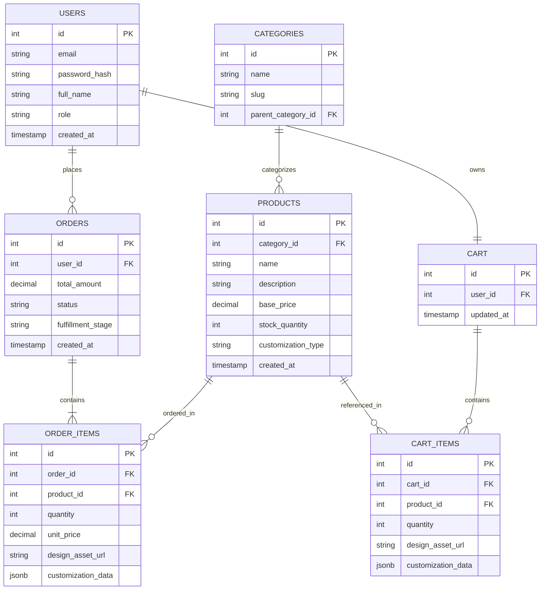

# Sprint 1: System Architecture & Scope Definition

**Course:** E-Commerce
**Project:** Custom Print-on-Demand Studio

---

## Section 1: Target Audience & Market Focus

**Primary Persona:** Small-to-mid-sized businesses, event organizers, and individual consumers who want personalized apparel and merchandise — ranging from a single custom-printed hoodie to a bulk order of branded corporate gear for a company event.

**Core Pain Point:** Existing print-on-demand platforms typically offer rigid templates and opaque, one-size-fits-all pricing. Customers need a way to upload their own vector artwork, see an accurate real-time mockup and price before committing, and track an order through a fulfillment pipeline that differs meaningfully from a standard retail SKU (production time, proofing, engraving/printing method).

**Domain Scope:** Apparel & Custom Merchandise — specifically personalized apparel, branded corporate gear, and custom-engraved items (e.g., drinkware, plaques, accessories).

---

## Section 2: MVP Feature Scope

| Category | Feature Name | Description | Priority |
|---|---|---|---|
| Authentication | User Registration & Authentication | Password hashing and JWT-based authentication mechanism for customer and admin accounts. | High (MVP) |
| Catalog | Product List & Search | Product browsing interface with taxonomy-based filtering by category, material, and customization type. | High (MVP) |
| Customization | Design Upload & Mockup Preview | Customer uploads a vector/raster asset (SVG, PNG) which is rendered onto a live product mockup with dynamic pricing based on print area, colors, and quantity. | High (MVP) |
| Cart | Cart Management | State-persistent cart management (item addition, modification, and deletion), including saved customization data per line item. | High (MVP) |
| Checkout | Order Processing | Mock or Stripe payment gateway integration, order object instantiation, and routing to the correct fulfillment queue (print, embroidery, or engraving). | High (MVP) |
| Admin | Inventory & Fulfillment Control | Administrative CRUD operations for base product inventory and order-status updates (queued → in production → shipped). | Medium |

---

## Section 3: Tech Stack Selection & Justification

- **Frontend Framework:** Next.js (React)
  *Justification:* Next.js gives server-side rendering for fast, SEO-friendly catalog pages while still supporting the highly interactive client-side canvas needed for the live mockup/customization tool. Its file-based routing and API routes also simplify the developer workflow for a small academic team compared to a bare React SPA.

- **Backend Infrastructure:** FastAPI (Python)
  *Justification:* FastAPI's async request handling suits the image-processing/mockup-generation endpoint well, since design uploads and rendering are I/O- and CPU-adjacent tasks that benefit from non-blocking execution. Its automatic OpenAPI/Swagger docs also give the team a self-documenting API contract for free, which is valuable when frontend and backend are developed by different members in parallel.

- **Database Management System:** PostgreSQL
  *Justification:* The domain is inherently relational — orders, order items, products, and categories have strict foreign-key relationships and require transactional integrity (e.g., decrementing stock and creating an order atomically). PostgreSQL's support for JSONB is also useful for storing flexible per-item customization metadata (design placement, color choice) without a full schema migration for every new customization option. SQLAlchemy/Pydantic integration with FastAPI makes schema validation straightforward.

- **Caching & Asynchronous Processing (Optional):** Celery + Redis
  *Justification:* Celery workers, backed by Redis as the broker, handle the CPU-bound mockup-rendering task asynchronously so it doesn't block FastAPI's request/response cycle. Redis also doubles as a fast store for guest cart/session persistence.

---

## Section 4: Entity-Relationship Diagram (ERD)

**Cardinality summary:**
- USERS 1:N ORDERS — a user places many orders.
- ORDERS 1:N ORDER_ITEMS — an order contains many line items.
- PRODUCTS 1:N ORDER_ITEMS — a product appears in many order line items.
- CATEGORIES 1:N PRODUCTS — a category groups many products.
- USERS 1:1 CART, CART 1:N CART_ITEMS — each user has one active cart with many items.
- PRODUCTS 1:N CART_ITEMS — a product can appear in many cart items.

